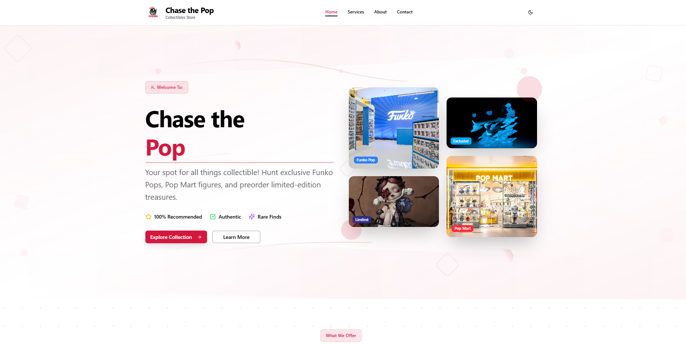

# 🛍️ Chase the Pop - Collectibles Store

Welcome to my collectibles store website project. This compact storefront is built with **Next.js**, **Tailwind CSS**, **Shadcn UI**, and **Framer Motion** to practice frontend development and showcase my business.

## About

This project is a Next.js app styled with Tailwind CSS, Shadcn UI, Framer Motion, and developed in **VS Code**. It is a place to learn modern frontend patterns while presenting collectible items. Additionally, it was an opportunity to learn new techniques for improving SEO, including optimizing metadata, structuring content, and ensuring clean, crawl-friendly code.

## Preview




## Features

- Product listing and product detail sections
- Contact & Inquiry Form
- Fully responsive layout
- Smooth UI transitions & animations
- Theme toggle (light / dark) with system preference support
- PWA-ready setup: manifest, icons
- Open Graph image + meta setup for social sharing and SEO

## Getting Started

**To view the project:**

1. Clone the repository:

    ```bash
    git clone https://github.com/mattkerbyy/Chase-the-Pop.git
    cd front-end
    ```

2. Install dependencies:

    ```bash
    npm install
    # or
    # yarn
    ```

3. Open your terminal and run the project locally:

    ```bash
    npm run dev
    # Open http://localhost:3000
    ```

> Recommended: Node.js 18+ for best compatibility with Next.js 14 and newer toolchains.

## Why I Made This

I built **Chase the Pop** to improve my frontend skills with Next.js, Tailwind CSS, Shadcn UI, and Framer Motion and to create a simple, attractive place to showcase and sell my collectibles.

---

Thank you for checking out my project! If you’d like, you can support my business at https://www.facebook.com/ChasethePopFB
